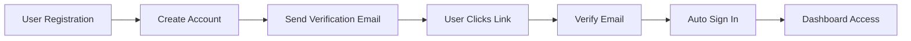
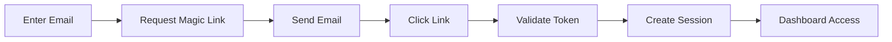

# System Design Documentation

## Overview
Modern authentication system built with Next.js 15.5.2 and Better Auth 1.3.8, featuring multiple authentication methods, email verification, and a robust security architecture.

## Tech Stack

### Core Technologies
- **Framework**: Next.js 15.5.2 (App Router, Turbopack)
- **Runtime**: Bun 1.2.16
- **Language**: TypeScript 5
- **Authentication**: Better Auth 1.3.8
- **Database**: SQLite with Prisma ORM 6.15.0
- **Styling**: Tailwind CSS 4
- **Email**: Nodemailer 7.0.6
- **State Management**: TanStack React Query 5.87.1
- **Code Quality**: Biome 2.2.0

## Architecture

### Application Structure
```
test-project/
├── src/
│   ├── app/                    # Next.js App Router pages
│   │   ├── api/
│   │   │   └── auth/
│   │   │       └── [...all]/   # Better Auth API routes
│   │   ├── (auth)/            # Authentication pages
│   │   │   ├── login/
│   │   │   ├── signup/
│   │   │   ├── magic-link/
│   │   │   ├── forgot-password/
│   │   │   ├── reset-password/
│   │   │   └── verify-email/
│   │   ├── dashboard/          # Protected routes
│   │   └── page.tsx           # Home page
│   ├── lib/
│   │   ├── auth.ts            # Better Auth server config
│   │   └── auth-client.ts     # Better Auth client config
│   └── providers/
│       └── query-provider.tsx  # React Query provider
├── prisma/
│   └── schema.prisma          # Database schema
└── public/                    # Static assets
```

## Authentication System

### Authentication Methods
1. **Email & Password**
   - Traditional authentication with email/password
   - Password minimum 8 characters
   - Email verification required

2. **Magic Link**
   - Passwordless authentication
   - 10-minute expiration
   - One-click sign-in via email

3. **Password Reset**
   - Secure token-based reset flow
   - 1-hour expiration
   - Email verification

### Better Auth Configuration

#### Server Configuration (`src/lib/auth.ts`)
```typescript
export const auth = betterAuth({
  database: prismaAdapter(prisma, {
    provider: "sqlite",
  }),
  emailAndPassword: {
    enabled: true,
    requireEmailVerification: true,
  },
  emailVerification: {
    sendOnSignUp: true,
    autoSignInAfterVerification: true,
  },
  plugins: [
    magicLink({
      expiresIn: 60 * 10, // 10 minutes
      sendMagicLink: async ({ email, url }) => {
        // Custom email sending
      },
    }),
  ],
  trustedOrigins: ["http://localhost:3000", "http://localhost:3001"],
});
```

#### Client Configuration (`src/lib/auth-client.ts`)
```typescript
export const authClient = createAuthClient({
  baseURL: process.env.NEXT_PUBLIC_APP_URL || "http://localhost:3001",
  plugins: [magicLinkClient()],
});
```

### Authentication Flow

#### Sign Up Flow


#### Magic Link Flow


## Database Schema

### Prisma Models
```prisma
model User {
  id            String    @id @default(cuid())
  email         String    @unique
  name          String?
  username      String?   @unique
  password      String?
  image         String?
  emailVerified Boolean   @default(false)
  createdAt     DateTime  @default(now())
  updatedAt     DateTime  @updatedAt
  sessions      Session[]
  accounts      Account[]
}

model Session {
  id        String   @id @default(cuid())
  expiresAt DateTime
  token     String   @unique
  ipAddress String?
  userAgent String?
  userId    String
  user      User     @relation(fields: [userId], references: [id], onDelete: Cascade)
  createdAt DateTime @default(now())
  updatedAt DateTime @updatedAt
}

model Account {
  id                    String    @id @default(cuid())
  accountId             String
  providerId            String
  userId                String
  user                  User      @relation(fields: [userId], references: [id], onDelete: Cascade)
  accessToken           String?
  refreshToken          String?
  idToken               String?
  accessTokenExpiresAt  DateTime?
  refreshTokenExpiresAt DateTime?
  scope                 String?
  password              String?
  createdAt             DateTime  @default(now())
  updatedAt             DateTime  @updatedAt

  @@unique([providerId, accountId])
}

model Verification {
  id         String   @id @default(cuid())
  identifier String
  value      String
  expiresAt  DateTime
  createdAt  DateTime @default(now())
  updatedAt  DateTime @updatedAt

  @@unique([identifier, value])
}
```

## API Routes

### Authentication Endpoints
All authentication endpoints are handled by Better Auth through the catch-all route:
- **Route**: `/api/auth/[...all]`
- **Handler**: `toNextJsHandler(auth)`

#### Available Endpoints
- `POST /api/auth/sign-up` - User registration
- `POST /api/auth/sign-in/email` - Email/password login
- `POST /api/auth/sign-in/magic-link` - Magic link request
- `POST /api/auth/sign-out` - Sign out
- `GET /api/auth/verify-email` - Email verification
- `POST /api/auth/forgot-password` - Password reset request
- `POST /api/auth/reset-password` - Password reset
- `GET /api/auth/session` - Get current session

## Email System

### SMTP Configuration
```env
SMTP_HOST=smtps-proxy.fastmail.com
SMTP_PORT=443
SMTP_SECURE=true
SMTP_USER=michael@steele.red
SMTP_PASS=***********
FROM_EMAIL=groupup@steele.red
FROM_NAME=GroupUp
```

### Email Templates
1. **Verification Email**
   - Subject: "Verify your email address"
   - Contains verification link
   - Expires after signup

2. **Magic Link Email**
   - Subject: "Your magic sign-in link"
   - Contains one-click sign-in link
   - 10-minute expiration

3. **Password Reset Email**
   - Subject: "Reset your password"
   - Contains password reset link
   - 1-hour expiration

### Email Transport
```typescript
const transporter = nodemailer.createTransport({
  host: process.env.SMTP_HOST,
  port: Number(process.env.SMTP_PORT),
  secure: process.env.SMTP_SECURE === "true",
  auth: {
    user: process.env.SMTP_USER,
    pass: process.env.SMTP_PASS,
  },
});
```

## Pages & Routes

### Public Routes
- `/` - Home page with auth status
- `/login` - Email/password sign-in
- `/signup` - User registration
- `/magic-link` - Magic link sign-in
- `/forgot-password` - Password reset request
- `/reset-password` - New password form
- `/verify-email` - Email verification status

### Protected Routes
- `/dashboard` - User dashboard (requires authentication)

### Route Protection
```typescript
useEffect(() => {
  if (!isPending && !session) {
    router.push("/login");
  }
}, [session, isPending, router]);
```

## State Management

### React Query Configuration
```typescript
const queryClient = new QueryClient({
  defaultOptions: {
    queries: {
      staleTime: 60 * 1000, // 1 minute
    },
  },
});
```

### Session Management
```typescript
const { data: session, isPending } = useSession();
```

## Security Features

### Password Security
- Minimum 8 characters required
- Hashed using Better Auth's built-in bcrypt
- Secure password reset flow

### Token Security
- CUID tokens for sessions
- JWT for API authentication
- Time-based expiration

### CORS Configuration
```typescript
trustedOrigins: ["http://localhost:3000", "http://localhost:3001"]
```

### Environment Variables
- Sensitive data in `.env.local`
- Client-safe variables prefixed with `NEXT_PUBLIC_`
- Never committed to version control

## Development Workflow

### Scripts
```json
{
  "dev": "next dev --turbopack",
  "build": "next build --turbopack",
  "start": "next start",
  "lint": "biome check",
  "format": "biome format --write"
}
```

### Database Migrations
```bash
# Generate Prisma client
bunx prisma generate

# Push schema to database
bunx prisma db push

# View database
bunx prisma studio
```

## Performance Optimizations

### Next.js Optimizations
- Turbopack for faster builds
- App Router for better code splitting
- React Server Components by default
- Image optimization with Next/Image

### Database Optimizations
- SQLite for development simplicity
- Indexed fields (email, username, token)
- Cascade deletes for data integrity

### Client Optimizations
- React Query for caching
- Optimistic updates
- Stale-while-revalidate pattern

## Error Handling

### Authentication Errors
- Invalid credentials
- Email not verified
- Token expired
- Network failures

### User Feedback
- Loading states
- Success messages
- Error messages
- Redirect handling

## Testing Considerations

### Test Authentication Flows
1. Sign up with email/password
2. Verify email
3. Sign in with credentials
4. Sign in with magic link
5. Reset password
6. Sign out

### Test Protected Routes
- Unauthorized access redirects
- Session persistence
- Token expiration

## Deployment Considerations

### Environment Setup
1. Set production environment variables
2. Use production database (PostgreSQL recommended)
3. Configure SMTP for production
4. Set secure BETTER_AUTH_SECRET
5. Update trusted origins for production domain

### Database Migration
```bash
# Production migration
bunx prisma migrate deploy
```

### Security Checklist
- [ ] Strong BETTER_AUTH_SECRET
- [ ] HTTPS only in production
- [ ] Secure SMTP credentials
- [ ] Rate limiting on auth endpoints
- [ ] CSRF protection
- [ ] Content Security Policy headers

## Future Enhancements

### Potential Features
1. Social authentication (OAuth providers)
2. Two-factor authentication (2FA)
3. Remember me functionality
4. Account deletion
5. Profile management
6. Role-based access control (RBAC)
7. Audit logging
8. Rate limiting
9. Captcha integration
10. Webhook notifications

### Scalability Considerations
1. Move to PostgreSQL for production
2. Implement Redis for session storage
3. Add CDN for static assets
4. Implement API rate limiting
5. Add monitoring and analytics

## Monitoring & Logging

### Recommended Tools
- Sentry for error tracking
- Vercel Analytics for performance
- LogRocket for session replay
- DataDog for infrastructure monitoring

### Key Metrics
- Authentication success/failure rates
- Email delivery rates
- Session duration
- API response times
- Database query performance

## Support & Maintenance

### Regular Tasks
1. Update dependencies monthly
2. Review security advisories
3. Monitor email delivery rates
4. Clean up expired sessions
5. Backup database regularly

### Troubleshooting Guide
1. **CORS errors**: Check trusted origins
2. **Email not sending**: Verify SMTP credentials
3. **Database errors**: Check migrations
4. **Session issues**: Clear cookies/storage
5. **Build failures**: Check TypeScript errors